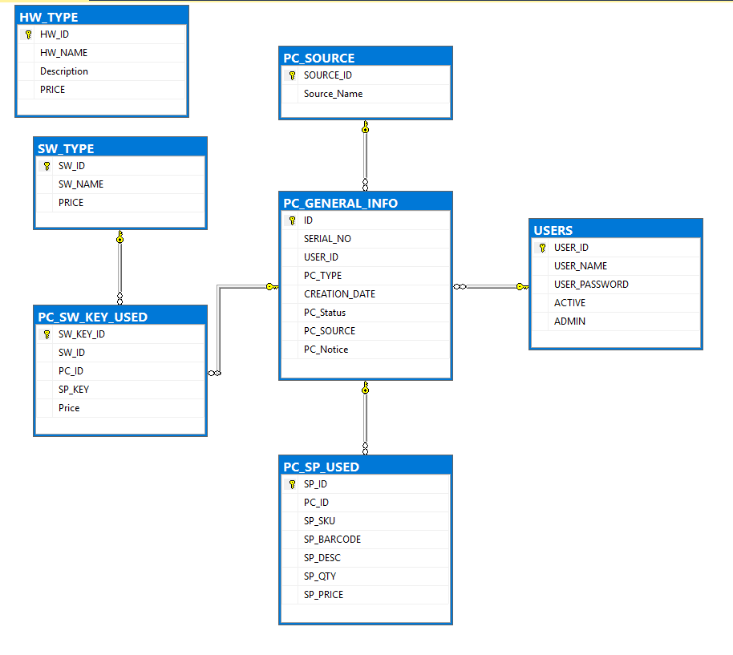
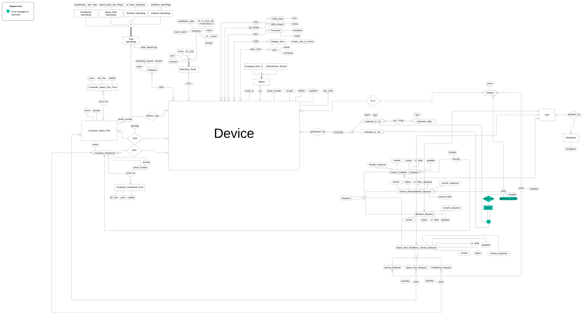

# Ertiqa System


## Overview
This is a Django web application project developed for **[Ertiqa organization](https://ertiqa.org/)**, aiming to tack the inspecting and refurbishing/scraping process of electronics at **[Ertiqa](https://ertiqa.org/) organization**.

## Project Status

Please note that this project is currently **unfinished** and **not in use** by [Ertiqa](https://ertiqa.org/).

## Table of Contents
- [Database Design and Modeling](#database-design-and-modeling)
- [Prerequisites](#prerequisites)
- [Installation](#installation)
- [Credits](#credits)
- [Disclaimer on Assets](#disclaimer-on-assets)

## Database Design and Modeling

### Old Relational Data Model Before Refactoring



### New Conceptual Data Model After Refactoring



### New Relatioanl Data Model After Refactoring


## Prerequisites

Before you begin, ensure you have met the following requirements:

- **Python 3.7** or higher installed on your machine.
- **pip** (Python package installer) is available.
- **virtualenv** or **venv** for creating virtual environments.
- **Git** installed for version control.
- **[PostgreSQL](https://www.postgresql.org/)** database installed. See their website for instructions.

## Installation

Follow these steps to set up the project on your local machine.

### 1. Clone the Repository

First, clone the repository from GitHub to your local machine using `git`:

```
git clone https://github.com/kbits000/ertiqa_system.git
```

### 2. Create and Activate a Virtual Environment
On Windows
```
python -m venv .venv

.venv\Scripts\activate 
```

### 3. Install Project Dependencies
Project dependecies are listed in `requirements.txt` file.
Using the following command to install them
```
pip install -r requirements.txt
```

### 4. Set Up Environment Variables
On Windows, in Command Prompy:

Create empty `.env` file
```
type NUL > .env
```

Add the following to the .env file
```
SECRET_KEY='1234'
DEBUG=True
DB_NAME=''
DB_USER=''
DB_PASSWORD=''
DB_HOST=''
DB_PORT=''
```

Update DB_NAME, DB_USER, DB_PASSWORD, DB_HOST and DB_PORT variables in  `.env` file with the correct values.

Generate secret key **SECRET_KEY** for the Django project
```
from django.core.management.utils import get_random_secret_key
print(get_random_secret_key())
```
Copy the generated secret key and paste it in the field of **SECRET_KEY** in `.env`

### 5. Apply Database Migrations
Run the following commands to apply migrations:
```
python manage.py makemigrations

python manage.py migrate
```

### 6. Create a Superuser
```
python manage.py createsuperuser
```

### 7. Start the Web App
```
python manage.py runserver
```

# Credits
- **[Ertiqa](https://ertiqa.org/)** - All logos and branding materials are the property of [NGO Name] and are used here with permission.
- **[kbits000](https://github.com/kbits000)** - Project development and code implementation.

## Disclaimer on Assets

All logos and branding materials included in this repository are the property of **[Ertiqa](https://ertiqa.org/)**. They should not be reproduced or used elsewhere without explicit consent from [Ertiqa](https://ertiqa.org/).